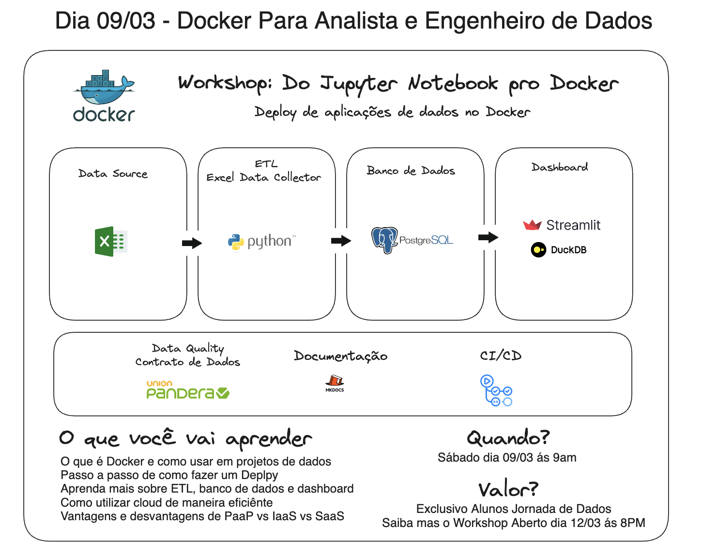

# Deploy de Aplicações de Dados Utilizando Docker

## Objetivo do Workshop

Este workshop de 4 horas visa fornecer aos analistas de dados e engenheiros de dados uma introdução prática ao uso do Docker para deploy de aplicações de dados. Os participantes aprenderão a empacotar e implantar eficientemente aplicações de dados, incluindo uma ETL em Python, um banco de dados PostgreSQL e um dashboard interativo usando Streamlit, tudo dentro de containers Docker.

## Cinco Motivos para Aprender Docker em Nosso Workshop

1. **Ensino do Zero**: Independentemente do seu nível de experiência prévia, vamos começar com os conceitos básicos de Docker, assegurando que todos os participantes tenham uma compreensão sólida dos fundamentos para construir sobre eles.

2. **Facilidade para Subir o Deploy**: Demonstraremos como Docker simplifica o processo de deploy de aplicações, permitindo que você foque na construção e no aprimoramento de suas aplicações, em vez de gastar tempo com configurações complexas de ambiente.

3. **Solução Versátil**: Docker é uma ferramenta poderosa que resolve uma variedade de problemas de desenvolvimento e operações, facilitando a colaboração entre equipes e melhorando a eficiência no ciclo de vida de desenvolvimento de software.

4. **Vantagens de Utilizar Docker na Cloud**: Explore como Docker se integra perfeitamente com serviços de cloud, potencializando a escalabilidade, a portabilidade e a eficiência dos recursos em ambientes de cloud computing.

5. **Solução Moderna**: Aprenda sobre as práticas atuais de desenvolvimento e operações que estão moldando o futuro da tecnologia. Docker é uma habilidade essencial em muitas áreas de TI, incluindo engenharia de dados, e dominá-la abrirá novas oportunidades profissionais.

## Agenda

### Parte 1: Introdução ao Docker (9:00 - 10:30)

- **9:00 - 9:15**: Boas-vindas e Introdução
- **9:15 - 9:45**: Docker e o Ecossistema de Cloud
- **9:45 - 10:00**: Introdução ao Heroku
- **10:00 - 10:30**: Prática: Deploy de uma Aplicação Simples no Docker

### Intervalo (10:30 - 11:00)

### Parte 2: Aplicações de Dados Avançadas com Docker (11:00 - 13:00)

- **11:00 - 11:30**: Deploy de um Banco de Dados PostgreSQL com Docker
- **11:30 - 12:15**: Construção de uma Solução de Dashboard com Streamlit e DuckDB
- **12:15 - 12:55**: Projeto Integrado: Dashboard com Dados do PostgreSQL
- **12:55 - 13:00**: Conclusão e Encerramento

## Pré-requisitos

- Assistir ao vídeo de Python + Vscode + Git
- Assistir ao vídeo de Poetry

## Estrutura do Projeto

Este repositório contém os diretórios e arquivos necessários para acompanhar as atividades práticas do workshop:

- `dashboard/`: Contém os arquivos para o deploy do dashboard Streamlit.
- `etl/`: Contém os scripts de ETL para processamento de dados.
- `postgres/`: Contém os arquivos necessários para configurar o banco de dados PostgreSQL em um container Docker.

## Como Usar

Cada diretório no repositório contém um `README.md` com instruções específicas sobre como construir e executar as aplicações correspondentes usando Docker.# Docker
